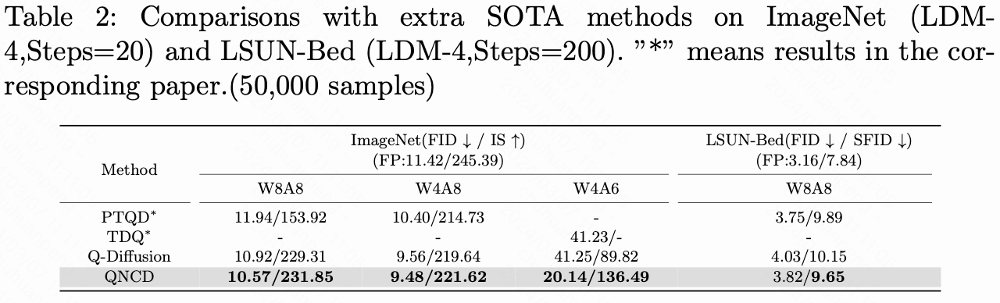
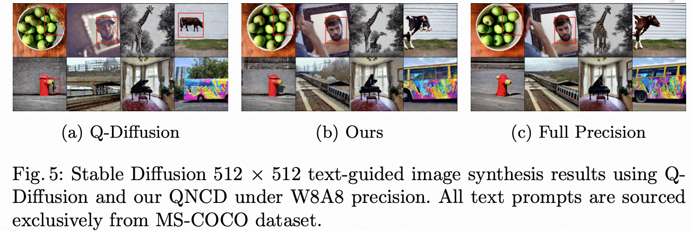
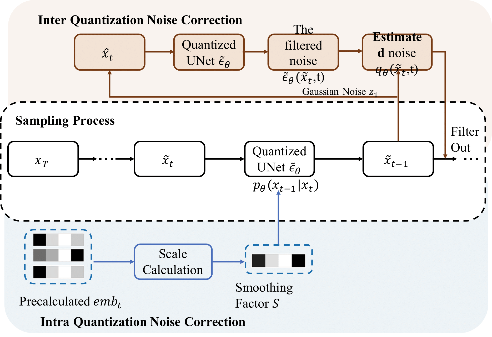

# QNCD: Quantization Noise Correction for Diffusion Models

QNCD is the first work to explore model quantization of diffusion models down to 6-bit activation quantization. Simultaneously, QNCD is able to achieve lossless quantization under W4A8 and W8A8 settings, as shown in the following table: 



In more complex text-guided image generation tasks (MS-COCO), our method surpasses existing techniques in terms of statistical metrics (FID and CLIP Score, visual results, and Image Quality Assessment (IQA) scores:





## Overview

  

QNCD identify two primary quantization challenges: *intra* and *inter* quantization noise. Intra quantization noise, mainly exacerbated by embeddings in the resblock module, extends activation quantization ranges, increasing disturbances in each single denosing step. Besides, inter quantization noise stems from cumulative quantization deviations across the entire denoising process, altering data distributions step-by-step. 

QNCD combats these through embedding-derived feature smoothing for eliminating intra quantization noise and an effective runtime noise estimatiation module for dynamicly filtering inter quantization noise.

## Getting Started

### Installation

Clone this repository, and then create and activate a suitable conda environment named `qncd` by using the following command:

```bash
cd QNCD
conda env create -f environment.yml
conda activate qncd
```

### Usage

1. For Latent Diffusion and Stable Diffusion experiments, first download relvant checkpoints 
2. Run  full-precision models to build calibration datasets
3. For W4A8 and W4A6 settings, you should use Brecq to obtain corresponding quantized checkpoints
4. Then use the following commands for calculation quantization scales and synthesizing images:

# CIFAR-10 (DDIM)
# 8/8-bit 
python scripts/sample_diffusion_ddim.py --config configs/cifar10.yml --use_pretrained --timesteps 100 --eta 0 --skip_type quad --ptq --weight_bit 8 --quant_mode qncd  -l <output_path> --cali_ckpt <quantized_ckpt_path> --sample_reverse 4

# MS-COCO (Stable Diffusion)
# 8/8-bit 
python scripts/txt2img.py \
--plms --cond  --weight_bit 8 --quant_mode qncd --quant_act --act_bit 8 \
--cali_st 25 --cali_batch_size 1 --cali_n 128 --no_grad_ckpt  --ptq \
--scale_split_static --sample_reverse --reverse_interval 10 \
--running_stat --sm_abit 16 --from_file val_ann.txt --n_samples 2 

# Calculate FID/IS
python evaluator.py     \
<Real_dataset>  \
<Synthesized_dataset>


